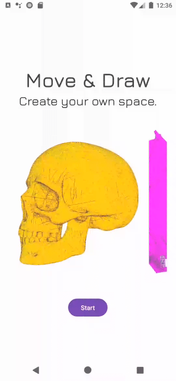
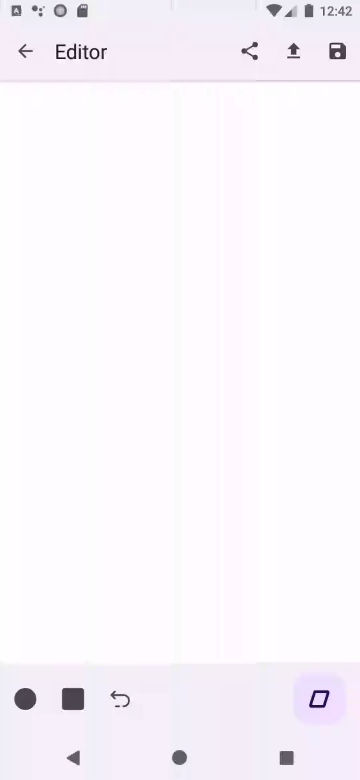
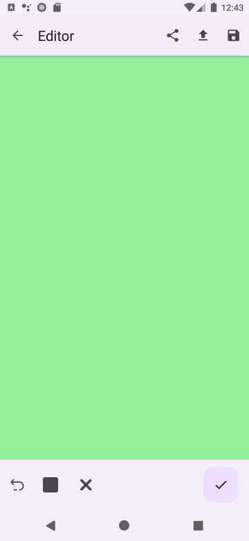
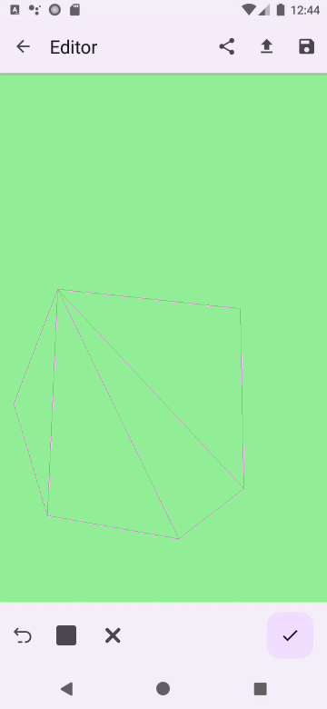

# Move & Draw
## _Create Your Own Space._

   

## Table of Contents

- [Description](#description)
- [System Requirements](#system-requirements)
- [Installation](#installation)
- [Instructions](#instructions)
  - [I. Going to Editor Screen](#i-going-to-editor-screen)
  - [II. Clicking on Add Face Button](#ii-clicking-on-add-face-button)
  - [III. Making dots on Face Sketch Surface by clicking on that](#iii-making-dots-on-face-sketch-surface-by-clicking-on-that)
  - [IV. Clicking on Save Face Sketch Button](#iv-clicking-on-save-face-sketch-button)
- [Testing](#testing)
- [Dependencies](#dependencies)
- [Contributors](#contributors)

## Description
This is a small application for making and editing 3D drawings with your Android device. The main principle can be formulated like this: any drawing is a set of faces, so in order to make one, you should set these faces by defining their vertices. The app is written in Kotlin and based on the OpenGL ES framework. Every drawing is saved as an .OBJ file and can be used by a variety of other graphical applications. 

## System Requirements

Your device has to meet the following requirements:
- Android OS with API Level $\geq$ 21 (version 5.0 or higher);
- OpenGL ES 2 or higher;
- 1 GB of RAM;
- ~50 MB of free space.

## Installation

In order to get an app on your device, one needs to hit the following Google Play link: .

## Instructions

Once you've gotten prepared for drawing your first (mb not first) 3-dimensional painting, your steps will be kind of about the following:

##### I. Going to Editor Screen

##### II. Clicking on Add Face Button

##### III. Making dots on Face Sketch Surface by clicking on that

##### IV. Clicking on Save Face Sketch Button

## Testing

Almost all crucial components of the app have been covered with tests (Unit & Instrumental). The coverage percentage was roughly 60-70% at the time.

## Dependencies

The following noticeable libraries & frameworks are in use in the app:
- [ColorPickerView](https://github.com/skydoves/ColorPickerView) (leveraging an utility dialog that allows you to pick a color);
- [Navigation Framework](https://developer.android.com/guide/navigation) (for handling transitions between fragments & activities);
- [Dagger Hilt](https://dagger.dev/hilt/) (Dependency Injection framework);
- [Room](https://developer.android.com/jetpack/androidx/releases/room) (for building an Application - Database communication layer);
- [Mockito](https://github.com/mockito/mockito) (for mocking classes' objects in tests);
- [Espresso](https://developer.android.com/training/testing/espresso) (for Instrumental Testing);
- [Turbine](https://github.com/cashapp/turbine) (for testing Kotlin Flows).

## Contributors

The application was fully made by Semyon Dzukaev in 2024. All rights reserved.
